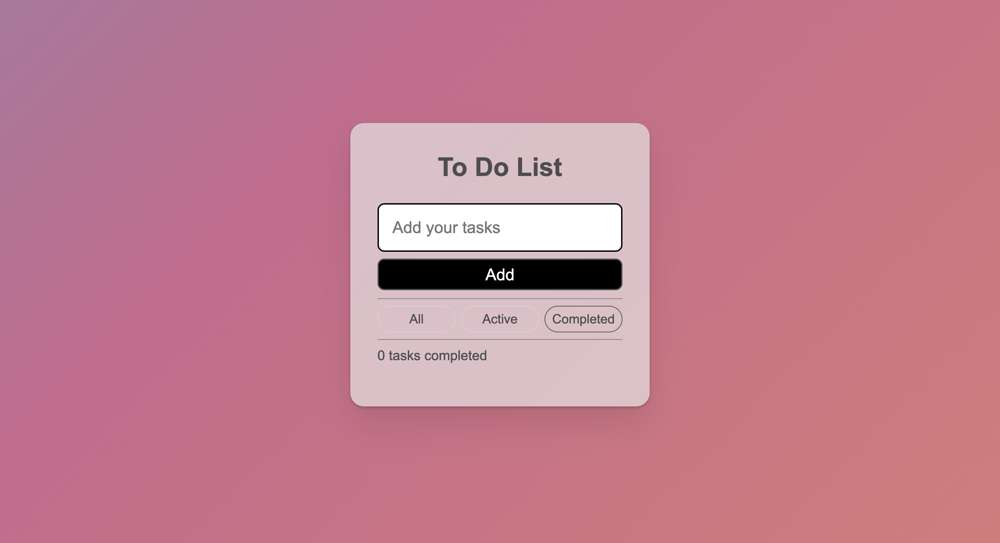
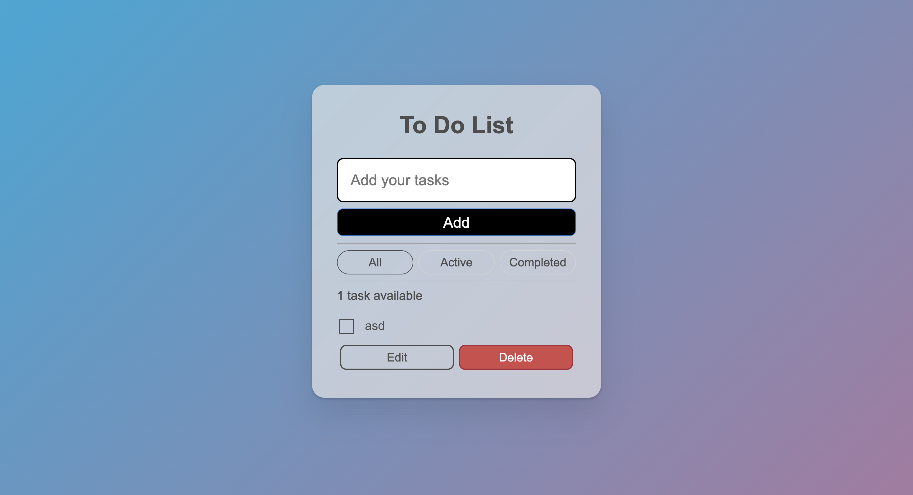
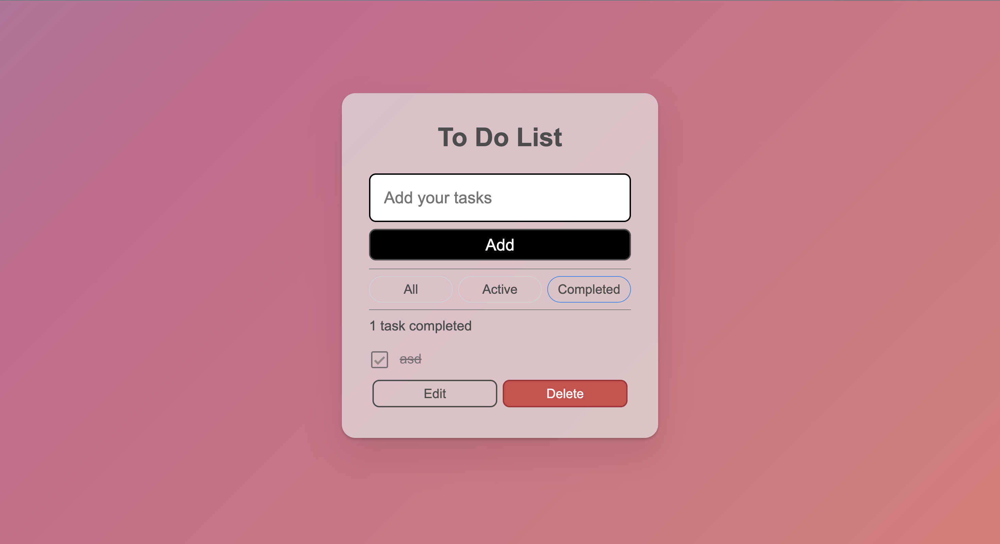

# React To Do App
This is a simple, responsive React application that allows users to manage their to-do list with ease. It features the ability to:

- **Add new tasks**: Simply enter the task description and hit enter to add it to the list.
- **Mark tasks complete**: Check the box next to a task to mark it as done.
- **Delete tasks**: Click the delete icon to remove unwanted tasks from the list.
- **Filter tasks**: View only active tasks (not completed), all tasks (including completed), or completed tasks separately.

## Technologies Used
- **React**: For building the user interface and managing state.
- **React Hooks**: Used useState and useEffect For managing the application state and side effects.
- **CSS**: For styling the app and ensuring responsiveness across devices.

## Usage
- **Add new tasks**: Enter a title for todo in the input field and click add.
- **Mark tasks complete**: Click the checkbox next to the task.
- **Delete tasks**: Click the delete button below to the task.
- **Edit tasks**: Click the edit button below the task.
- **Filter tasks**: Use the buttons or dropdown menu to switch between "All", "Active", and "Completed" views.

## Screenshots of the Web App

### 0 completed tasks

### 1 task

### 1 task completed
